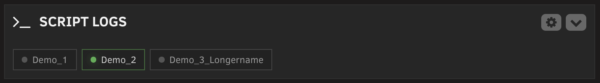
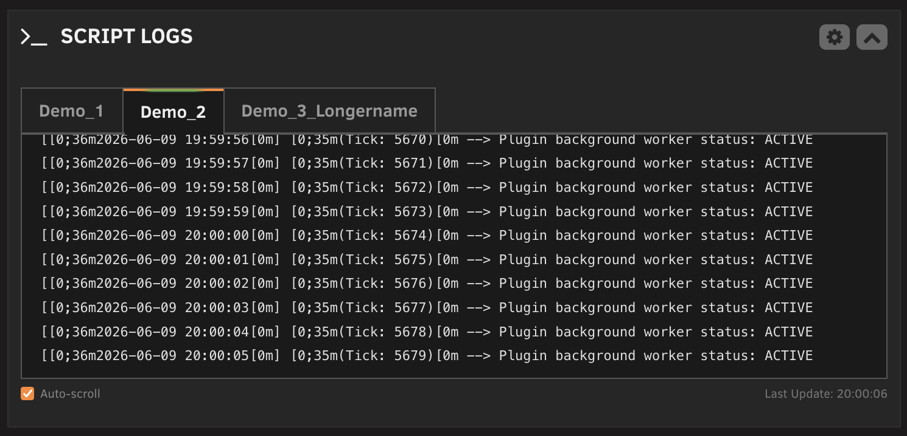
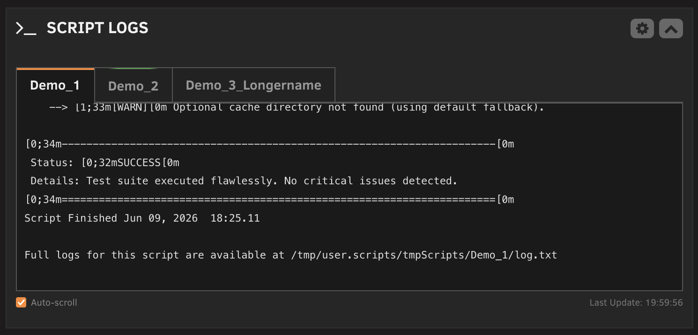
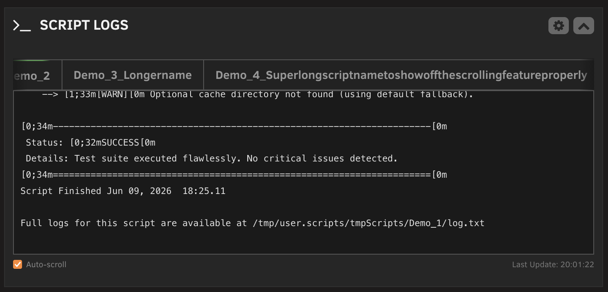

# Scriptlogs for Unraid

Scriptlogs adds a compact dashboard widget for selected User Scripts. It shows script status and log output directly on the Unraid Dashboard, without keeping the User Scripts page open.

## Screenshots

<p>
  
  
</p>
<p>
  
  
</p>

## Features

- Dashboard tile for selected User Scripts.
- Color-coded script tabs for running and idle scripts.
- Collapsed dashboard state with compact status chips.
- Custom dashboard order for selected scripts.
- Scrollable log viewer with optional auto-scroll.
- Live log output for scripts running in the background.
- Optional display of the last known background log for idle scripts.
- Configurable refresh interval.
- Configurable log font size.
- Optional removal of empty log lines.
- Light and dark theme support.
- Dedicated settings page with compact script selection and drag handles.

## Requirements

- Unraid 6.9 or newer.
- [User Scripts](https://forums.unraid.net/topic/48286-plugin-user-scripts/) by Andrew Zawadzki.

## Installation

Scriptlogs is available through Unraid Community Applications.

For manual installation:

1. Open the Unraid web interface.
2. Go to **Plugins**.
3. Click **Install Plugin**.
4. Paste this URL and install:

   ```text
   https://raw.githubusercontent.com/jo-sobo/scriptlogs-unraid-plugin/main/scriptlogs.plg
   ```

## Configuration

Open **Settings > User Utilities > Scriptlogs Settings** in the Unraid web interface.

Available settings:

- **Automatic refresh:** Enable or disable dashboard updates.
- **Refresh interval:** Set how often the widget checks script status and logs.
- **Idle script logs:** Show the last saved background log when a script is idle.
- **Log font size:** Choose the text size used in the dashboard log viewer.
- **Empty log lines:** Remove or preserve blank lines in log output.
- **Script selection:** Choose which User Scripts appear in the dashboard widget.
- **Dashboard order:** Drag selected scripts into the preferred tab order.

Click **Apply** to save changes. The dashboard widget updates on the next refresh.

## How It Works

The dashboard widget polls a local plugin API at the configured refresh interval.

Status detection uses the User Scripts runtime state:

- Foreground scripts are detected from the process list via `startScript.sh`.
- Background scripts are detected through `/tmp/user.scripts/running/`.

Log output is read from User Scripts log files in:

```text
/tmp/user.scripts/tmpScripts/<script-name>/log.txt
```

Scriptlogs tails the most recent log output, optionally removes empty lines, and displays it in the dashboard tile. It preserves the selected tab across refreshes when possible. Foreground scripts still write their live output to the User Scripts window, so Scriptlogs shows a short notice instead of duplicating that stream.

## Support

For general support, use the Unraid forum thread:

https://forums.unraid.net/topic/192397-plugin-scriptlogs

Source code and issue tracking are on GitHub:

https://github.com/jo-sobo/scriptlogs-unraid-plugin/issues

## Acknowledgments

Thanks to Andrew Zawadzki for creating and maintaining the User Scripts plugin.

## Donation

If Scriptlogs is useful to you, donations are welcome:

https://coff.ee/magnum.308

## License

This project is licensed under the GPL v3. See [LICENSE](LICENSE) for details.
